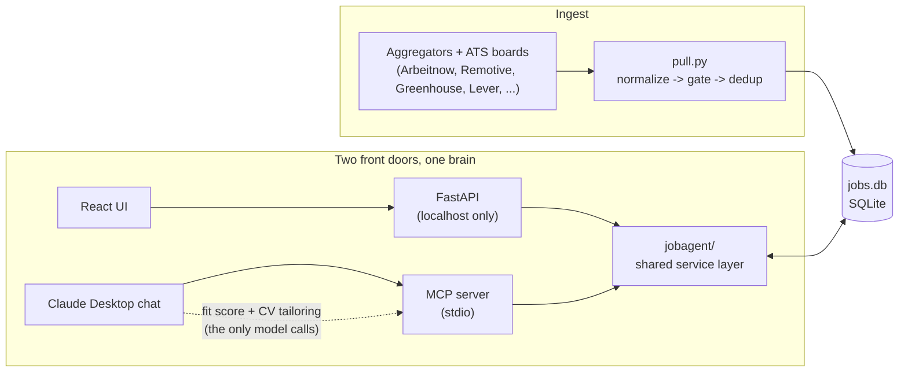
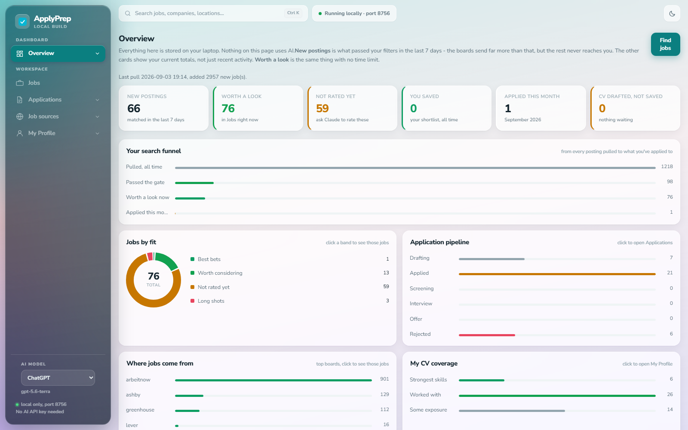
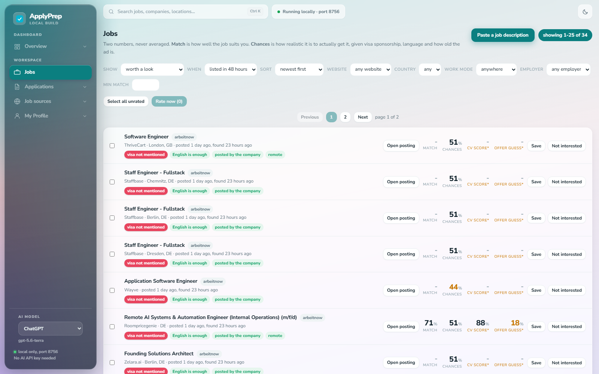
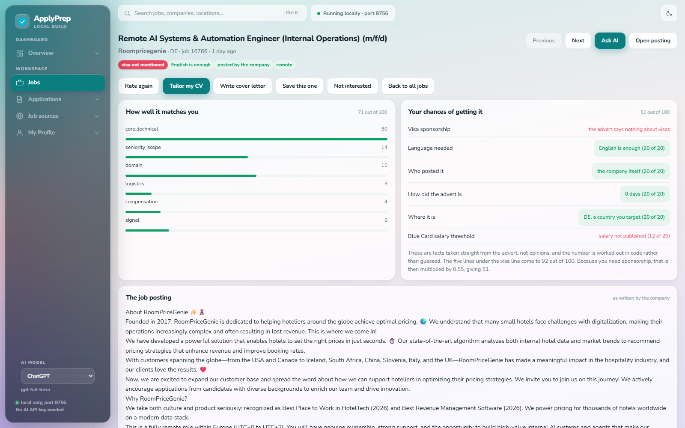
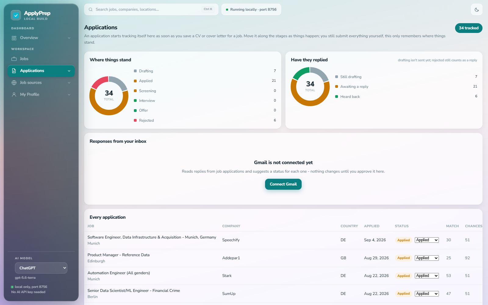
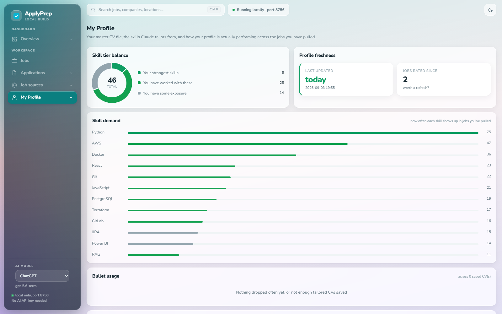

# ApplyPrep

Local job discovery pipeline. Pulls postings from documented APIs and public
ATS boards into one SQLite file. Scoring and document tailoring happen in
Claude chat over MCP, so this codebase makes zero model calls and needs no
API key.

## Architecture

Jobs get pulled and scored for **reach** (is it landable) entirely in Python.
**Fit** (is it a good match) is the one judgement call, made by Claude in
chat and written back over MCP - everything else in the diagram runs
locally with no API key.

## Product tour

ApplyPrep is a local-first workspace for finding relevant roles, keeping fit
and reachability separate, tailoring documents, and tracking applications.

| Dashboard | Job discovery |
| --- | --- |
|  |  |

| Job evaluation | Application tracking |
| --- | --- |
|  |  |

| Profile insights |
| --- |
|  |

## Setup

    python -m venv .venv
    .venv\Scripts\activate
    pip install -r requirements.txt

Then create your own profile from the templates:

    cp master.example.yaml master.yaml
    cp profile.example.yaml profile.yaml

`master.yaml` is your full career history - every bullet you have ever earned,
each with a stable id. `profile.yaml` is what you are looking for: target
titles, countries, and sponsorship needs. Both are gitignored, so your personal
details stay on your machine and never reach the repository.

Fill them in, then initialise the database:

    python cli.py init

## Use

    python cli.py pull
    python cli.py pull --countries DE,NL --since-days 14
    python cli.py pull --only greenhouse,lever
    python cli.py list --gate passed
    python cli.py list --gate rejected --why
    python cli.py regate
    python cli.py reach
    python cli.py dedup
    python cli.py dedup --apply
    python cli.py watchlist
    python cli.py serve --reload

`regate` re-evaluates every stored job against the current config.yaml. Run it
after editing the gate block, otherwise changes only affect jobs pulled later.

`reach` recomputes reachability for every stored job. Run it after editing the
`reach` block or profile.yaml.

`dedup` is a dry run by default and prints what it would combine. Nothing is
merged until you add `--apply`.

## Gmail replies (optional)

Applications on the Applications tab can be matched against replies in your
own Gmail inbox - a rejection, an interview invite, a screening call - and
show up as a suggestion you approve or dismiss. Nothing is ever applied
automatically; every match is a click you make yourself.

This is entirely optional and off until you set it up. Nothing is sent
anywhere - it only reads your inbox with Google's read-only Gmail scope, and
the credential file and the token it gets back both stay local and gitignored.

To turn it on, click **Connect Gmail** on the Applications page. The first
time, it walks through:

1. Create a project at [console.cloud.google.com](https://console.cloud.google.com/)
   (free).
2. Enable the **Gmail API** for that project (APIs & Services -> Library).
3. Configure the OAuth consent screen: External, Testing mode is fine for
   personal use, and add your own Google account as a test user.
4. Create an OAuth Client ID of type **Desktop app** (APIs & Services ->
   Credentials -> Create Credentials -> OAuth client ID).
5. Paste the Client ID and Client Secret it gives you into the dialog. Both
   are stored in your local, gitignored `jobs.db` - never in a file in the
   repo, never committed.

Saving them immediately opens a Google sign-in tab; approve it and the tab
closes itself. Click **Check inbox now** afterwards whenever you want it to
look for new replies.

If you would rather manage the credential as a file (useful if you only ever
use the CLI): save the downloaded JSON as `gmail_client_secret.json` in this
project's root folder - that exact filename is already gitignored - and run
`python cli.py gmail-auth`. A pasted credential always takes priority over
the file if both exist.

Google's consent screen stays in "Testing" mode unless you publish it, which
means the refresh token it gives you expires after about a week - if the app
reports it needs reconnecting, step 6 is all you need to repeat.

`gmail.lookback_days` in `config.yaml` controls how far back each check
searches (default 30 days).

## Sources

Aggregators, in `adapters/aggregator/`:

- arbeitnow, keyless, publishes a visa sponsorship flag as structured data
- remotive, remoteok, we work remotely, keyless, remote roles only
- adzuna, needs free developer keys, the only source with real salary data.
  Set `ADZUNA_APP_ID` and `ADZUNA_APP_KEY` or fill them into config.yaml and it
  enables itself.

ATS boards, in `adapters/ats/`: greenhouse, lever, ashby, workable. These take
one company token per call and are driven by `watchlist.yaml`, which holds 72
boards that were checked against the live endpoints. `cli.py watchlist` prints
them and refreshes the `company` table.

The three remote boards apply a region filter before storing anything, because
they are mostly United States roles. A posting is kept if it names a European
country or city, says Europe, EMEA or EU, or is open worldwide. A posting that
names only somewhere else is dropped. Turn it off per source with
`region_filter: false`.

## Two scores, never blended

`fit` is merit and is written by Claude in chat. `reach` is whether the job is
landable and is computed in Python by `reach.py`, from facts in the advert:
sponsorship, language, direct employer or agency, how old the advert is, where
it is, and whether the salary clears the Blue Card threshold.

Sponsorship is a multiplier, not another line item. The other five come to a
score out of 100, then a job that says nothing about visas is multiplied by
0.55 and one that rules sponsorship out by 0.05, because for someone who needs
sponsorship nothing else matters if the answer is no. Weights and the
threshold live in the `reach` block of config.yaml.

`save_scores` over MCP ignores any reach the model sends.

## Layout

    jobagent/
        config.py       config loading, env override for Adzuna keys
        schema.sql      SQLite schema
        store.py        all database access
        normalize.py    source payload to one job shape
        gate.py         rules gate, pure functions
        reach.py        reachability from facts, pure functions
        dedup.py        three duplicate passes, pure functions
        watchlist.py    watchlist.yaml to company records
        pull.py         orchestration
        gmail_sync.py   harvests replies from Gmail into application_email
        gmail_match.py  matches a harvested email to an application, guesses
                        what it means; never applies a status by itself
        gmail/          OAuth (PKCE) + a thin Gmail API client
        service.py      shared query layer for FastAPI and MCP
        api.py          FastAPI routes, serves ui/dist
        agent.py        the only module that invokes a model
        documents/      tailoring, fabrication guard, coverage, lint, render
        adapters/
            base.py
            aggregator/  arbeitnow, remotive, remoteok, wwr, adzuna
            ats/         board.py, greenhouse, lever, ashby, workable
    cli.py
    mcp_server.py
    config.yaml
    watchlist.yaml

## Build order

All eleven steps are done:

1. skeleton, config, schema
2. arbeitnow adapter end to end
3. normalize and store
4. gate
5. remaining aggregator adapters: remotive, remoteok, wwr, adzuna
6. ats board adapters: greenhouse, lever, ashby, workable
7. dedup.py, three passes
8. reach.py
9. mcp server
10. documents module
11. fastapi and react ui

## Gate defaults

Two filters do almost all the work, and they pull in opposite directions.

`title_must_match` is an allowlist. A title matching none of its terms is
rejected. On a general board this is the dominant filter: the first live pull
of 362 Arbeitnow postings left 23. That looks brutal but most of a general
German board is nursing, logistics and retail, so the kill rate is a property
of the source, not a bug. It is also the first thing to widen when the list
feels thin.

`title_must_not_match` is the exclusion list, and it only removes junior and
student roles.

A job whose advert confirms visa sponsorship skips the allowlist, because a
company that sponsors is worth a look even if the title is worded oddly. The
exclusion list still applies first. Watch this one: a company that sponsors
across the whole organisation drags in its legal, quality and programme roles,
so the exclusion list is what keeps the passed list honest.

Everything else is permissive on purpose. German requirement, contract type
and salary are recorded on the job but do not reject, because a gate that
kills on ambiguity loses roles silently. Those feed the reachability score
instead.

Matching is on whole words, with hyphen, slash, underscore and dot treated as
spaces, so `ai engineer` matches "AI-Engineer" and `rpa` does not match
"Verpackung". Substring matching cost us a packaging shift-supervisor role in
the passed list before this was fixed.

Run `python cli.py regate` after any change here.
